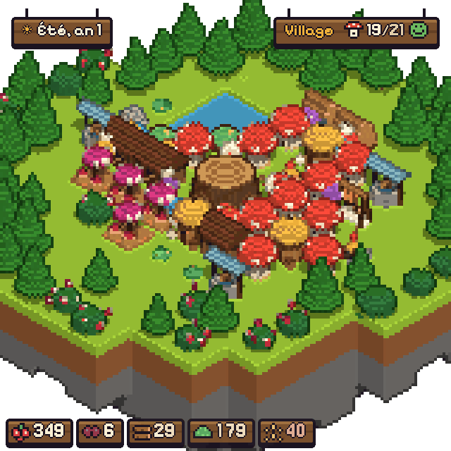
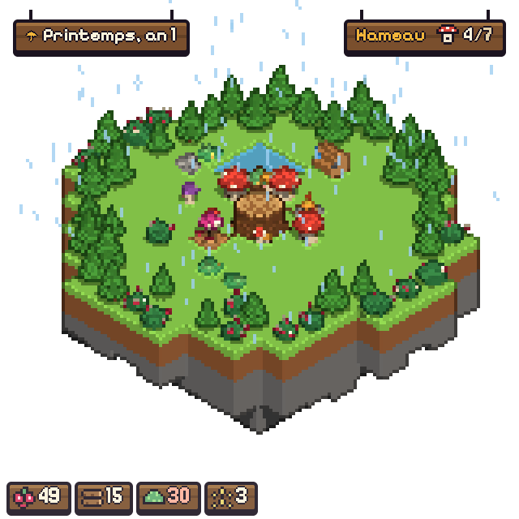
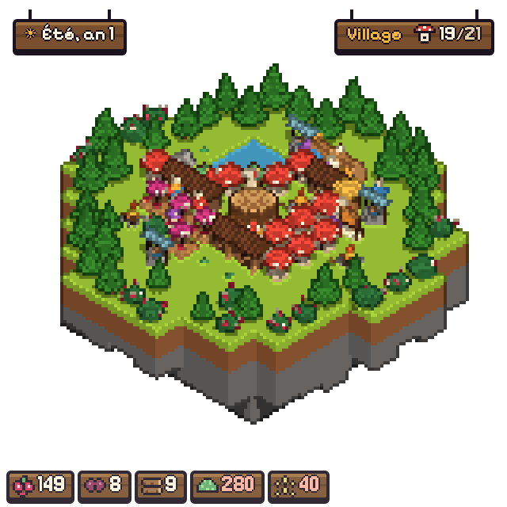
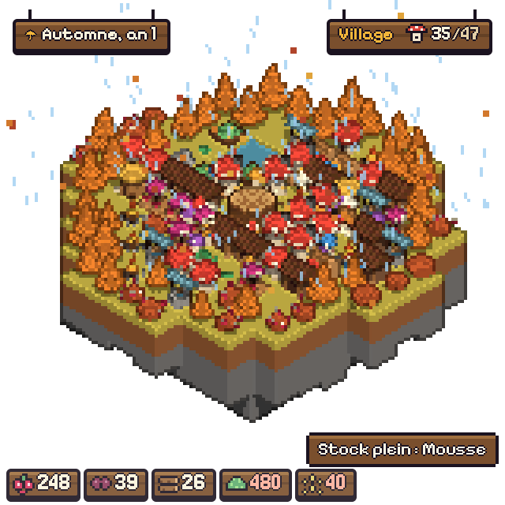
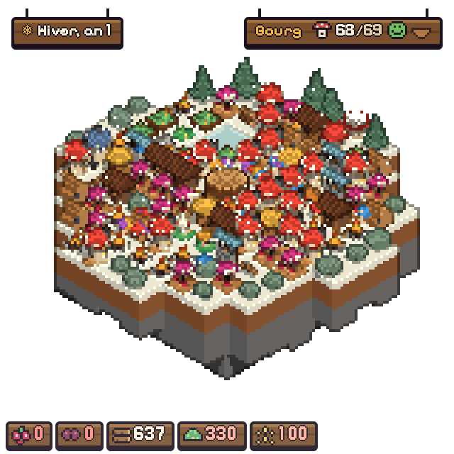
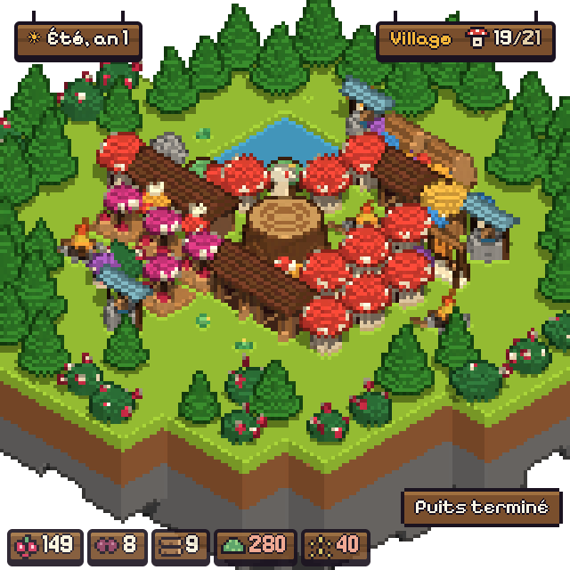

<div align="center">


# Tiny Shrooms

**Une petite ville de champignons sur une île flottante, qui vit dans un coin de ton écran.**

[](https://github.com/Magicelian/tiny-shrooms/releases/latest/download/Tiny-Shrooms-Mac-Apple-Silicon.dmg)
[](https://github.com/Magicelian/tiny-shrooms/releases/latest/download/Tiny-Shrooms-Mac-Intel.dmg)
[](https://github.com/Magicelian/tiny-shrooms/releases/latest/download/Tiny-Shrooms-Windows.exe)




</div>

## 🍄 Le jeu

- 🧺 **On commence seul** : un clic sur un buisson, du bois mort ou de la mousse, et on récolte.
- 🏡 **Les habitants arrivent**, prennent les emplois et construisent tout seuls.
- ⬆️ **Les huttes montent en gamme** (maison, puis manoir) quand leurs besoins sont satisfaits : nourriture, chaleur, eau, commerce.
- 🌦️ **Les saisons passent** : la pluie, la neige et la nuit changent l'île et le rythme de la production.
- 🌱 **Au bourg, on renaît** sur une nouvelle île, avec des pouvoirs qui rendent chaque partie plus rapide.

C'est un jeu **idle** et apaisant : on n'y perd jamais rien, et on y jette un œil quand on veut. La fenêtre fait
320 × 320 pixels et reste au-dessus des autres.

<table align="center">
  <tr>
    <td align="center"><br /><sub><b>Hameau</b> · printemps</sub></td>
    <td align="center"><br /><sub><b>Village</b> · été</sub></td>
    <td align="center"><br /><sub><b>Village</b> · automne</sub></td>
    <td align="center"><br /><sub><b>Bourg</b> · hiver</sub></td>
  </tr>
</table>

## 📦 Installer

Un clic sur le lien qui correspond à ton ordinateur, et le téléchargement démarre :

| Ordinateur | Télécharger |
|---|---|
| 🍎 **Mac Apple Silicon** (puce M1, M2, M3, M4…) | [Tiny-Shrooms-Mac-Apple-Silicon.dmg](https://github.com/Magicelian/tiny-shrooms/releases/latest/download/Tiny-Shrooms-Mac-Apple-Silicon.dmg) |
| 🍏 **Mac Intel** (Mac d'avant fin 2020) | [Tiny-Shrooms-Mac-Intel.dmg](https://github.com/Magicelian/tiny-shrooms/releases/latest/download/Tiny-Shrooms-Mac-Intel.dmg) |
| 🪟 **Windows** | [Tiny-Shrooms-Windows.exe](https://github.com/Magicelian/tiny-shrooms/releases/latest/download/Tiny-Shrooms-Windows.exe) |

Pour savoir quel Mac tu as : menu Pomme → **À propos de ce Mac**. « Puce » = Apple Silicon, « Processeur Intel » = Intel.

<details>
<summary><b>🍎 Mac : installation pas à pas</b></summary>

1. Ouvre le `.dmg` et glisse **Tiny Shrooms** dans **Applications**.
2. Le jeu n'est pas signé par Apple, donc macOS le bloque au premier lancement. Deux façons de le débloquer :
   - **Réglages Système → Confidentialité et sécurité**, puis **Ouvrir quand même** en bas de la page ;
   - ou, dans le Terminal, une fois le jeu dans Applications :
     ```bash
     xattr -cr "/Applications/Tiny Shrooms.app"
     ```
3. Le jeu n'apparaît pas dans le Dock : il vit dans la **barre des menus**, en haut de l'écran 🍄.

</details>

<details>
<summary><b>🪟 Windows : installation pas à pas</b></summary>

1. Lance `Tiny-Shrooms-Windows.exe`.
2. Si SmartScreen affiche un avertissement : **Informations complémentaires**, puis **Exécuter quand même**.
3. L'icône du jeu apparaît dans la zone de notification, en bas à droite.

</details>

## 🎮 Jouer



| Action | Commande |
|---|---|
| Construire, récolter, inspecter | **clic** |
| Déplacer la fenêtre | **glisser** |
| Déplacer la vue | `⌘` + glisser<br />(`Ctrl` sous Windows) |
| Zoomer | **molette** ou `Z` |
| Tourner l'île | `←` `→` ou `Q` `E` |

Si la fenêtre n’est pas active, le premier clic ne fait que l’activer. Position verrouillée (menu de l’icône) : glisser déplace la vue.

Le **menu de l'icône** permet d'afficher ou de cacher la fenêtre, de verrouiller sa position, et de régler le son
(coupé au départ) et la langue.

💾 La partie s'enregistre toute seule. Appli fermée, le jeu est en pause ; fenêtre cachée, la ville continue de vivre.

🔄 Les mises à jour se téléchargent seules : quand l'une d'elles est prête, **Redémarrer pour mettre à jour**
apparaît dans le menu de l'icône.

<br clear="right" />
